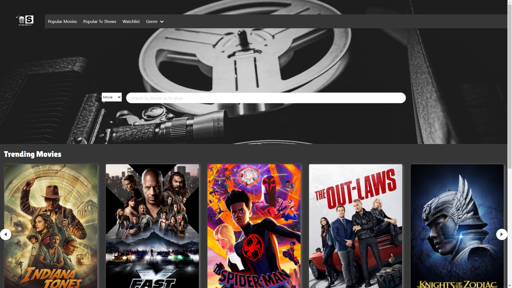

## Streamly!

## Description

In the modern age, individuals eager to watch movies or television shows often find themselves having to search across multiple streaming platforms to see if their favorite content is available. This process can be quite cumbersome and time-consuming. To address this issue and provide users with a convenient solution, we conceived the idea of creating STREAMLY!

STREAMLY! is a single app designed to make it effortless for users to find information on their favorite shows. It offers the following features:

- Displaying popular movies of the week.
- Showcasing popular TV shows.
- Allowing users to add shows to their watchlist for easy access.
- Enabling users to search for movies and TV shows based on specific genres.
- The search functionality provides results for the specific movie or show searched and also suggests similar finds.
- The "More Info" button provides details on streaming platforms where the content is available; if not available, it displays a concise movie overview.

With STREAMLY!, users can conveniently explore the streaming options for their favorite movies and TV shows without the hassle of scouring multiple platforms, making entertainment more accessible and enjoyable.

## Live Demo

[STREAMLY!](https://drive.google.com/file/d/15zhbdlgEpbUOERvDVZ4WGuTp1Ysd_daU/view)

## ScreenShots

## Credits

Sucheta Mukherjee - https://github.com/sucheta90

Safwaan Ahmed - https://github.com/safwaan41

Lilibeth Mejia - https://github.com/lilym036

Jaden Jordan - https://github.com/Mr-JadenDJordanS52

Rusty Lewis - https://github.com/hotperformancehorses

## Sources

BackGround Image -
https://unsplash.com/photos/SnXIF8_2oPw

TMDB - https://developer.themoviedb.org/docs

WatchMode - https://api.watchmode.com/

SweetAlert - https://sweetalert2.github.io/

Bulma - https://bulma.io/

Adobe Express - https://www.adobe.com/express/

Google Fonts - https://fonts.google.com/

## Links

https://github.com/hotperformancehorses/entertainment-finder
https://hotperformancehorses.github.io/entertainment-finder/

## Future Develoments

- Search bar consistency accross pages
- Ability to search Actors/ Actressess or crew information
- Make the site mobile friendly
- Watchlist section to include a delete button to remove already watched shows.
- To show separate lists to buy or rent from streaming services.
- Show movie/ tv trailers.
- Code refactoring/ clean up.
- Fix carousel design.
